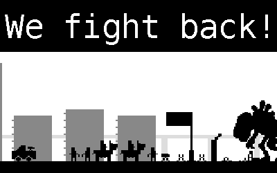

# 

An apocalyptic typing game created for JS13kGames 2019. Correctly typing the displayed words will fight off the monster invading your town.

Play here: https://jaller94.gitlab.io/we-fight-back/

You can read my [progress updates here](https://mastodonten.de/@jaller94/tagged/js13k).

## How to play
Giant monsters are roaming through the world, threatening your town and family.
In this typing game, you're defending your city against a giant monster by typing the displayed story.

Select a level by pressing 1, 2 or 3.
From now on type the highlighted words. Include spaces, full stops, exclamation marks and question marks.
Finish the texts before the monster reaches your base!

On the success and failure screen, press space to return to the main menu. Pressing H on the failure screen will give you insights in how close you got to the goal (spoiler alert).

The extras for monetized subscribers are a mode where the texts of the story got shuffled and the option to defend Berlin.

## Thanks to
* My coworkers for playtesting, giving feedback and being super excited about my game.
* Elio from [ura.design](https://ura.design/) who provided me with design ideas.
* Ebay and the arcade [GameOn in Berlin](https://gameon.events/) for hosting a js13k games meetup.
* Andrzej for organizing the js13k each year and playing Initial D against me at said meetup.
* Everyone who votes for my game, so I get a t-shirt. 👍👀
* Vancouver for being my home for the last two years and Berlin for being my new home.
* My boss for hopefully being ok with me finishing a game at 5 AM on a weekday.

### Sound libraries
* [miniMusic](https://github.com/xem/miniMusic)
* [Zuper Zmall Zeeded Zound Zynth](https://zzfx.3d2k.com/)

### Used graphics
* fossils3 (includes standing t-rex): CC-BY 3.0 https://opengameart.org/content/fossil-undead-rpg-enemy-sprites

### Used Software
The game is written in JavaScript and uses [Parcel](https://parceljs.org/) for building.

Furthermore, I loved creating this using:
* Manjaro Linux
* Firefox
* Atom text editor
* [Aseprite](https://mastodonten.de/@jaller94/102776442577034458)
* Inkscape
* GNU Image Manipulation Program

### License
Released under the AGPL 3.0 or later license.  
See LICENSE file for more information.

Developed by Christian Paul.  
Feel free to contact me at:  
https://gitlab.com/jaller94  
http://chrpaul.de
